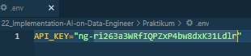

### **Tugas**

### **Soal Prioritas 1 (80)**

1. Set Environment dan Dataset:
    - Siapkan dataset penjualan dalam format CSV atau Excel.
    - Dataset harus mencakup informasi penting seperti tanggal, jumlah penjualan, harga, kategori produk, dan lainnya.
    
    - Buat file **.env** untuk menyimpan kredensial API OpenAI (misalnya, **OPENAI_API_KEY**).
    
    
2. Integrasi OpenAI API
    - Gunakan Python untuk membaca kredensial dari file **.env**.
    - Integrasikan OpenAI API dengan skrip Python Anda untuk menganalisis dataset penjualan.
    [File-Python_Prioritas-1](Soal_Prioritas-1.ipynb)
3. Optimasi Prompt Engineering:
    - Kembangkan berbagai prompt yang dirancang untuk mendapatkan insight dari dataset penjualan menggunakan OpenAI API.
    - Fokuskan pada analisis tren penjualan, segmentasi pelanggan, dan prediksi penjualan.
    Bisa dilihat juga pada [File-Python_Prioritas-1](Soal_Prioritas-1.ipynb)
4. Analisis dan Visualisasi Data:
    - Gunakan Pandas untuk analisis data awal dan visualisasi menggunakan Matplotlib atau Seaborn.
    - Bandingkan hasil analisis tradisional dengan insight yang diperoleh dari OpenAI API.
    Selengkapnya terkait Visualisasinya bisa di file ini -> [File-Python_Prioritas-1](Soal_Prioritas-1.ipynb)

    * Analisis Data Awal :
    - Dari sekian banyak yang ada dalam record dalam datasetnya, tidak ada data dalam suatu kolom nya yang NaN, tidak sesuai maupun yang lainnya. Terdapat 8 kolom yang berisi NO, tanggal_pembelian, jenis_tanaman, harga_satuan, stok, jumlah_terjual, jumlah_pendapatan, cuaca. NO berfungsi untuk sebagai Index dari datanya. Tanggal Pembelian berisi kapan pelanggan membeli tanaman tersebut. Harga satuan berisi harga satuan dari tanaman tersebut. Stok berisi jumlah tanaman yang masih tersedia dari tanaman tersebut. Jenis Tanaman berisi tanaman tersebut merupakan jenis apa dan terdapat berbagai macam jenis tanaman bisa dilihat pada Visualisasinya. Jumlah Terjual berisi dari berapa banyak stok yang terjual dari tanaman tersebut. Jumlah pendapatan merupakan banyaknya pendapatan dari tanaman tersebut. Lalu terdapat cuaca yang berisi cuaca yang cocok untuk tanaman tersebut.
    Lebih jelasnya bisa dilihat pada Visualisasi.

    * Perbandingan :
    - Dari Analisis yang saya lakukan sendiri maupun dari AI banyak terjadi perbandingan yang signifikan. Saya lebih menganalisis mengenai apa yang ada dalam datasetnya. Akan tetapi, AI bisa menyempurnakan itu dengan menyarankan kita sebagai user untuk menambahkan atau memikirkan mengenai Visualisasi maupun Analisis apa yang harus kita lakukan. Dan Hal itu juga sangat membantu untuk mengembangkan dataset penjualan ini agar nantinya bisa mendapatkan hasil Visualisasi ataupun pengolahan yang baik dari dataset yang digunakan dengan bantuan AI. Jadi, tidak sepenuhnya bisa dikerjakan oleh AI.

5. Dokumentasi Proses:
    - Dokumentasikan setiap langkah, mulai dari pengaturan lingkungan, pengolahan data, hingga analisis akhir.

    Terkait perintah diatas juga sudah terdapat pada File Jupyter Notebook [ini](Soal_Prioritas-1.ipynb)

    - Catat bagaimana penggunaan file **.env** dan OpenAI API mempengaruhi proses dan hasil analisis.

    File **.env** digunakan untuk menyimpan kredensial dan konfigurasi sensitif dalam proyek perangkat lunak, termasuk kunci API OpenAI. Dengan menggunakan **.env**,secara tidak langsung dapat melindungi kredensial, mengatur variabel lingkungan, menjaga keamanan, dan memberikan fleksibilitas dalam pengelolaan aplikasi. Ini memengaruhi proses dan hasil analisis dengan memastikan keamanan informasi sensitif, memungkinkan pengaturan yang fleksibel, dan memisahkan konfigurasi dari kode sumber aplikasi.