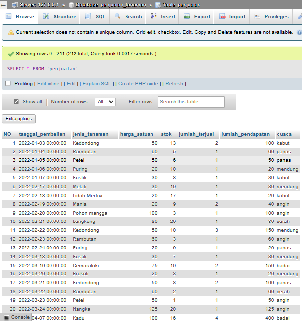
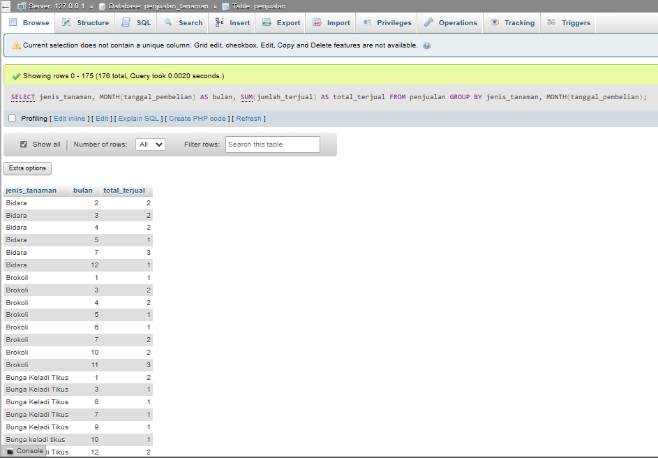

### Soal Prioritas **2 (20)**

Sebuah perusahaan retail ingin mengoptimalkan proses analisis data penjualan mereka. Mereka memiliki dataset penjualan yang mencakup informasi seperti tanggal transaksi, jumlah penjualan, harga, kategori produk, dan lainnya. Tujuan utama adalah untuk menghasilkan SQL queries yang dapat membantu dalam analisis data yang lebih efisien dan efektif.

1. Membuat Database
    - Buatkan tabel dengan atribut kurang lebih memiliki tanggal transaksi, jumlah penjualan, harga, kategori produk, dan lainnya
    
2. Generate SQL dengan OpenAI API:
    - Gunakan OpenAI API untuk menghasilkan SQL queries. Misalnya, berikan prompt seperti "**Buatkan SQL query untuk menghitung total penjualan per kategori produk setiap bulan.**"
    - Catat respons AI dan analisis keakuratan serta relevansi query yang dihasilkan.
    [File-ipynb_Prioritas-2](Soal_Prioritas-2[Penjelasan&Jawaban].md)

    * **Analisis Keakuratan respons yang diberikan :**
    - Untuk respon yang diberikan apabila prompt nya sesuai dengan isi dari database nya yang berkaitan seperti nama tabel, kolom nya disebutkan dalam promptnya OpenAI. Maka, akan menghasilkan response yang akurat juga dan berjalan apabila respons itu diimplementasikan kedalam Databasenya langsung. Jikalau, didalam prompt nya tidak didefinisikan secara jelas mengenai kebutuhan User seperti nama database, tabel dan kolomnya apa saja akan menimbulkan hasil yang lumayan bias untuk respons dari OpenAI nya.

3. Validasi Query SQL
    - Validasi SQL queries yang dihasilkan menggunakan sistem manajemen database yang ada. Pastikan query berjalan dengan benar dan menghasilkan output yang diharapkan.

    * **Validasi SQL Queries yang diberikan :**
    - Hampir sama dengan Poin 3 yakni, harus sering untuk memaksimalkan dalam menuliskan prompt agar bisa menghasilkan respons yang akurat. Saya tidak perlu untuk mengganti sendiri dari SQL Queries nya, akan tetapi saya mencoba mendefinisikan dengan lengkap pada prompt nya ketika saya mendapati error ketika diimplementasikan kedalam databasenya.

4. Implementasi dan Analisis Hasil:
    - Terapkan SQL queries yang telah divalidasi dan dioptimalkan dalam sistem database perusahaan.
    